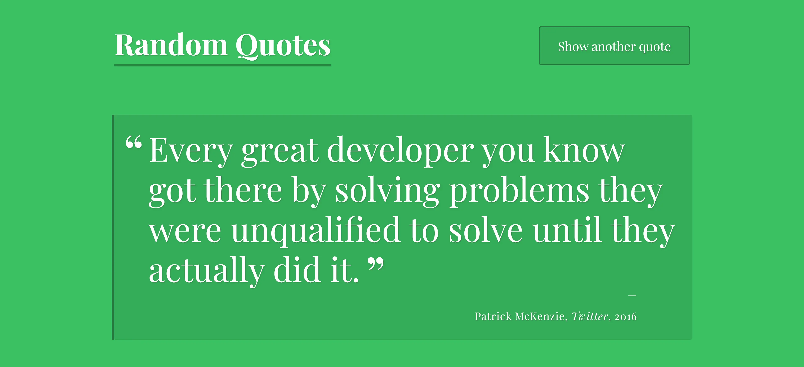

# Random Quote Generator

## Overview

The Random Quote Generator is a simple web application that displays a random quote each time the user clicks a button or after a specified interval. This was my first project in the [Treehouse](https://teamtreehouse.com/) full stack JavaScript techdegree. The project is built using HTML, CSS, and JavaScript, making it a great way to practice front-end development skills.

## Features

✅ Displays a random quote.\
✅Automatically refreshes the quote every 5 seconds.\
✅Allows users to click a button to generate a new quote immediately.\
✅ Randomly changes the background color with each new quote.\
✅Supports quotes with optional citation, year, and tags.

## 🖥️ Live Demo

You can see this project in action [here](https://hermanconnor.github.io/random-quote-generator/)

## ⌨️🖱️Technologies Used

- HTML
- CSS
- JavaScript

## 🛠️ Getting Started

### Installation

1. Clone the repository or download the ZIP file.
2. Open `index.html` in your web browser.

## 📌 Usage

1. Click the "Show Another Quote" button to generate a new random quote.
2. Wait for 5 seconds to see the quote change automatically.
3. Enjoy the inspirational messages!

## Example

Here is a preview of the app:

## Acknowledgments

- Special thanks to all the quote sources that inspired this project.
- Thanks to the [Treehouse](https://teamtreehouse.com/) coding community for providing invaluable resources and support.
